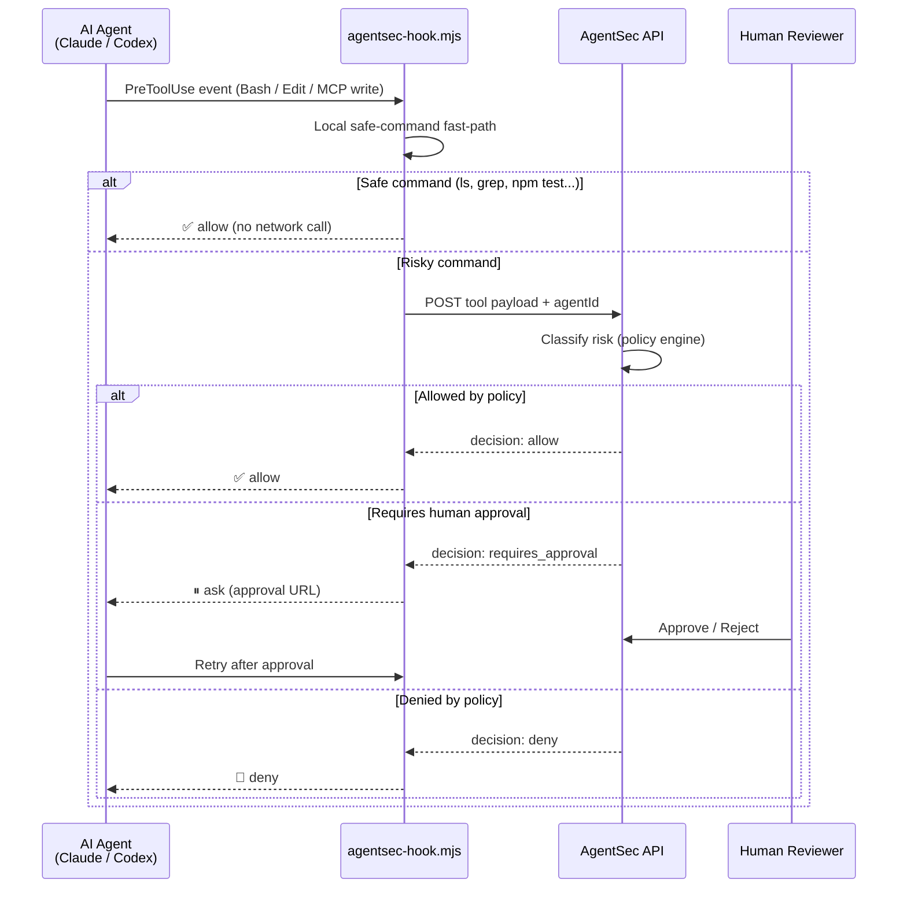

<div align="center">

# AgentSec Hook Pack

**Runtime security and policy enforcement hooks for AI coding agents**

[](https://nodejs.org)
[](https://claude.ai/code)
[](https://openai.com)
[](LICENSE)

</div>

---

## What It Does

AgentSec Hook Pack intercepts and classifies risky tool calls **before** an AI agent executes them — blocking destructive shell commands, secret exfiltration, unauthorized file edits, and unreviewed production deployments in real time.

Drop the hook into any project. Zero configuration for common workflows. Safe read-only commands (`ls`, `grep`, `npm test`) pass through instantly; dangerous ones get classified and held for human approval.

---

## How It Works



---

## Supported Agents

| Agent | Integration File | Matcher |
|---|---|---|
| **Claude Code** | `.claude/settings.json` | `Bash\|Edit\|Write\|mcp__.*` |
| **OpenAI Codex** | `.codex/config.toml` | `^Bash$\|^apply_patch$\|^mcp__.*` |

---

## Quick Start

### 1. Copy the hook into your project

```bash
# From the root of the repo you want to protect
cp -r /path/to/agentsec-hook-pack/.agentsec .
```

### 2. Set your API key

```bash
export AGENTSEC_API_KEY="your_api_key_here"
```

### 3. Wire the hook into your agent

**Claude Code** — add to `.claude/settings.json`:

```json
{
  "hooks": {
    "PreToolUse": [
      {
        "matcher": "Bash|Edit|Write|mcp__.*",
        "hooks": [
          {
            "type": "command",
            "command": "node .agentsec/hooks/agentsec-hook.mjs --client claude",
            "timeout": 15
          }
        ]
      }
    ]
  }
}
```

**Codex** — add to `.codex/config.toml`:

```toml
[[hooks.PreToolUse]]
matcher = "^Bash$|^apply_patch$|^mcp__.*"

[[hooks.PreToolUse.hooks]]
type = "command"
command = 'node "$(git rev-parse --show-toplevel)/.agentsec/hooks/agentsec-hook.mjs" --client codex'
timeout = 15
statusMessage = "Checking AgentSec policy"
```

---

## Configuration

Edit `.agentsec/config.json` to tune behavior:

```json
{
  "baseUrl": "https://promptshield-cyan.vercel.app",
  "mode": "observe",
  "agentId": "local-coding-agent",
  "failClosedFor": [
    "production_deploy",
    "database_migration",
    "env_secret_access",
    "customer_data_export"
  ],
  "safeCommands": ["ls", "pwd", "grep", "find", "npm test", "npm run lint"]
}
```

| Field | Description |
|---|---|
| `mode` | `observe` logs without blocking; `enforce` blocks on deny decisions |
| `failClosedFor` | Risk categories that always require human approval |
| `safeCommands` | Commands that bypass the API check entirely |

---

## What Gets Guarded

```
Tool call arrives
        │
        ├─ Bash commands ──── rm -rf, DROP TABLE, git push --force
        ├─ File edits ──────── .env writes, production config changes
        ├─ MCP writes ──────── mcp__*  (delete, write, deploy)
        └─ Secret access ───── env reads, keychain queries, token exports
```

---

## Project Structure

```
.agentsec/
  hooks/
    agentsec-hook.mjs       # Runtime hook — drop into any project
  config.json               # Policy configuration
.claude/
  settings.agentsec.example.json   # Claude Code snippet
.codex/
  config.agentsec.example.toml     # Codex snippet
docs/
  AGENTSEC_HOOK_PACK.md            # Integration guide
```

---

## Tech Stack

<div align="center">

&nbsp;
&nbsp;


</div>
